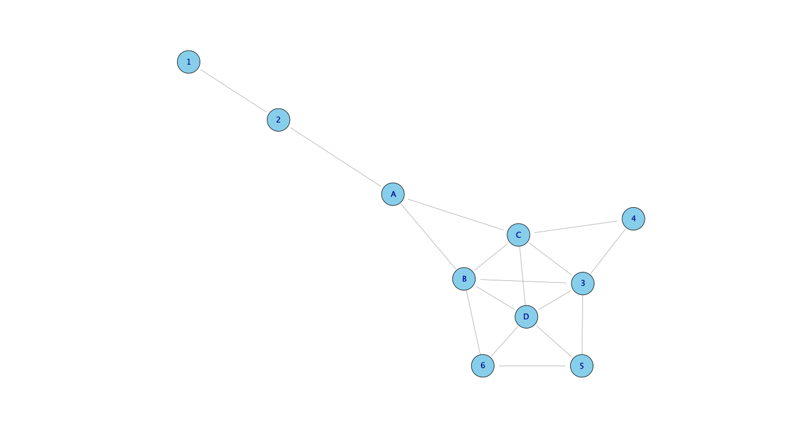

    knitr::opts_chunk$set(echo = TRUE)
    library(tidyverse)

    ## Warning: package 'ggplot2' was built under R version 4.3.1

    ## Warning: package 'lubridate' was built under R version 4.3.1

    ## ── Attaching core tidyverse packages ──────────────────────── tidyverse 2.0.0 ──
    ## ✔ dplyr     1.1.2     ✔ readr     2.1.4
    ## ✔ forcats   1.0.0     ✔ stringr   1.5.0
    ## ✔ ggplot2   3.5.0     ✔ tibble    3.2.1
    ## ✔ lubridate 1.9.3     ✔ tidyr     1.3.0
    ## ✔ purrr     1.0.1     
    ## ── Conflicts ────────────────────────────────────────── tidyverse_conflicts() ──
    ## ✖ dplyr::filter() masks stats::filter()
    ## ✖ dplyr::lag()    masks stats::lag()
    ## ℹ Use the conflicted package (<http://conflicted.r-lib.org/>) to force all conflicts to become errors

    library(igraph)

    ## Warning: package 'igraph' was built under R version 4.3.1

    ## 
    ## Attaching package: 'igraph'
    ## 
    ## The following objects are masked from 'package:lubridate':
    ## 
    ##     %--%, union
    ## 
    ## The following objects are masked from 'package:dplyr':
    ## 
    ##     as_data_frame, groups, union
    ## 
    ## The following objects are masked from 'package:purrr':
    ## 
    ##     compose, simplify
    ## 
    ## The following object is masked from 'package:tidyr':
    ## 
    ##     crossing
    ## 
    ## The following object is masked from 'package:tibble':
    ## 
    ##     as_data_frame
    ## 
    ## The following objects are masked from 'package:stats':
    ## 
    ##     decompose, spectrum
    ## 
    ## The following object is masked from 'package:base':
    ## 
    ##     union

    library(kableExtra)

    ## Warning: package 'kableExtra' was built under R version 4.3.1

    ## 
    ## Attaching package: 'kableExtra'
    ## 
    ## The following object is masked from 'package:dplyr':
    ## 
    ##     group_rows

    # Create a blank matrix
    adjacency_matrix <- matrix(0, nrow=10, ncol=10)

    # Define the names for the rows and columns for clarity
    rownames(adjacency_matrix) <- c("5", "6", "D", "3", "4", "B", "C", "A", "2", "1")
    colnames(adjacency_matrix) <- c("5", "6", "D", "3", "4", "B", "C", "A", "2", "1")

    # Connections for 5
    adjacency_matrix["5", c("D", "6", "3")] <- 1

    # Connections for 6
    adjacency_matrix["6", c("D", "B", "5")] <- 1

    # Connections for D
    adjacency_matrix["D", c("5", "6", "3", "B", "C")] <- 1

    # Connections for 3
    adjacency_matrix["3", c("D", "4", "C", "B", "5")] <- 1

    # Connections for 4
    adjacency_matrix["4", c("3", "C")] <- 1

    # Connections for B
    adjacency_matrix["B", c("6", "D", "C", "A", "3")] <- 1

    # Connections for C
    adjacency_matrix["C", c("3", "4", "B", "D", "A")] <- 1

    # Connections for A
    adjacency_matrix["A", c("C", "B", "2")] <- 1

    # Connections for 2
    adjacency_matrix["2", c("A", "1")] <- 1

    # Connections for 1
    adjacency_matrix["1", "2"] <- 1

    # Since the graph is undirected, we mirror the matrix along the diagonal
    adjacency_matrix <- adjacency_matrix + t(adjacency_matrix)
    # convert where the value is 2 to 1
    adjacency_matrix[adjacency_matrix == 2] <- 1

    #sort the matrix
    adjacency_matrix <- adjacency_matrix[order(rownames(adjacency_matrix)), order(colnames(adjacency_matrix))]

    # Print out the matrix
    adjacency_matrix

    ##   1 2 3 4 5 6 A B C D
    ## 1 0 1 0 0 0 0 0 0 0 0
    ## 2 1 0 0 0 0 0 1 0 0 0
    ## 3 0 0 0 1 1 0 0 1 1 1
    ## 4 0 0 1 0 0 0 0 0 1 0
    ## 5 0 0 1 0 0 1 0 0 0 1
    ## 6 0 0 0 0 1 0 0 1 0 1
    ## A 0 1 0 0 0 0 0 1 1 0
    ## B 0 0 1 0 0 1 1 0 1 1
    ## C 0 0 1 1 0 0 1 1 0 1
    ## D 0 0 1 0 1 1 0 1 1 0

    library(igraph)

    graph <- graph_from_adjacency_matrix(adjacency_matrix, mode = "undirected")

    # Plot the graph
    plot(graph, layout = layout_nicely(graph), vertex.color = "skyblue", edge.arrow.size = 0.5)

    # Calculate degree centrality for all nodes
    degree_centrality <- degree(graph, mode = "all")

    # Calculate closeness centrality for all nodes
    closeness_centrality <- closeness(graph, mode = "all")

    # Calculate betweenness centrality for all nodes
    betweenness_centrality <- betweenness(graph, directed = FALSE, normalized = TRUE)

    centrality_measures_all <- data.frame(
      Degree = degree_centrality,
      Closeness = closeness_centrality,
      Betweenness = betweenness_centrality
    )

    centrality_measures_all

    ##   Degree  Closeness Betweenness
    ## 1      1 0.03333333  0.00000000
    ## 2      2 0.04545455  0.22222222
    ## 3      5 0.06250000  0.12870370
    ## 4      2 0.05000000  0.00000000
    ## 5      3 0.04761905  0.01481481
    ## 6      3 0.05263158  0.02592593
    ## A      3 0.06250000  0.38888889
    ## B      5 0.07142857  0.25092593
    ## C      5 0.07142857  0.23888889
    ## D      5 0.06250000  0.09074074

    # Extract the centralities for seats A-D
    seat_choices <- c('A', 'B', 'C', 'D')
    centrality_measures <- data.frame(
      Degree = degree_centrality[seat_choices],
      Closeness = closeness_centrality[seat_choices],
      Betweenness = betweenness_centrality[seat_choices]
    )
    rownames(centrality_measures) <- seat_choices

Centrality Measures for Seats A-D

<table>
<thead>
<tr class="header">
<th></th>
<th style="text-align: right;">Degree</th>
<th style="text-align: right;">Closeness</th>
<th style="text-align: right;">Betweenness</th>
</tr>
</thead>
<tbody>
<tr class="odd">
<td>A</td>
<td style="text-align: right;">3</td>
<td style="text-align: right;">0.06250</td>
<td style="text-align: right;">0.388889</td>
</tr>
<tr class="even">
<td>B</td>
<td style="text-align: right;">5</td>
<td style="text-align: right;">0.07143</td>
<td style="text-align: right;">0.250926</td>
</tr>
<tr class="odd">
<td>C</td>
<td style="text-align: right;">5</td>
<td style="text-align: right;">0.07143</td>
<td style="text-align: right;">0.238889</td>
</tr>
<tr class="even">
<td>D</td>
<td style="text-align: right;">5</td>
<td style="text-align: right;">0.06250</td>
<td style="text-align: right;">0.090741</td>
</tr>
</tbody>
</table>

### Seat A

-   **Key Feature**: Highest betweenness centrality, lowest degree
    centrality.
-   **Benefit**: Sitting in Seat A positions you as a key bridge in the
    network, connecting different coworker groups. This is beneficial
    for meeting diverse individuals –&gt; can offer broad insights into
    the company culture and cross-departmental projects.
-   **Drawback**: The lower degree centrality means you might have fewer
    direct connections, potentially making it harder to quickly form a
    close-knit group of friends.

### Seat B

-   **Key Feature**: High degree and closeness centrality.
-   **Benefit**: access to a larger direct network and easier
    communication with others due to the high closeness centrality,
    facilitating exchange of information and support.
-   **Drawback**: the focus here is less on being the sole connector and
    more on being part of a cohesive network, which might **limit
    exclusive networking**.

### Seat C

-   **Key Feature**: Similar to Seat B.

### Seat D

-   **Key Feature**: High degree and closeness centrality but lowest
    betweenness centrality.
-   **Benefit**: Similar to B and C
-   **Drawback**: The lowest betweenness centrality = less ideal for
    those looking to play a bridging role between unconnected coworker
    groups (less networkhub role).

**In Summary**: - **For broad networking across diverse groups**: **Seat
A** - **For quickly establishing a strong, central presence in your
immediate network**: **Seats B, C, and D**

**What if…** - if you want to make the strongest bond with one person in
the bus, where should you sit, assuming every seat is available? - 1 or
2 - they have the least number of connections, they are far from the
rest of the network, and they are not in the middle of the network.

> If you choose 1, then 2 is your only bet and 2 has more
> “opportunities”. So if you want to make the strongest connection, you
> would sit in seat 2 and only talk to the person in seat 1.

    degree_centrality <- degree(graph, mode = "all")
    closeness_centrality <- closeness(graph, mode = "all")
    betweenness_centrality <- betweenness(graph, directed = FALSE)

    # Set up the layout of the graph just once to use in all plots
    layout <- layout_with_fr(graph)

    # Set up the plotting area
    par(mfrow = c(2, 2))

    # Degree Centrality Plot
    plot(graph, layout = layout,
         vertex.label = V(graph)$name,
         vertex.size = degree_centrality * 5,
         vertex.label.cex = 0.8,
         edge.arrow.size = 0.5,
         main = "Degree Centrality")

    # Closeness Centrality Plot
    plot(graph, layout = layout,
         vertex.label = V(graph)$name,
         vertex.size = closeness_centrality * 500,  # Scale factor to make the sizes visible, adjust as needed
         vertex.label.cex = 0.8,
         edge.arrow.size = 0.5,
         main = "Closeness Centrality")

    # Betweenness Centrality Plot
    plot(graph, layout = layout,
         vertex.label = V(graph)$name,
         vertex.size = betweenness_centrality / max(betweenness_centrality) * 50,  # Normalize and scale, adjust as needed
         vertex.label.cex = 0.8,
         edge.arrow.size = 0.5,
         main = "Betweenness Centrality")

    # Resetting to default single plotting layout
    par(mfrow = c(1, 1))

    par(mai = c(0, 0, 0.5, 0.5))
